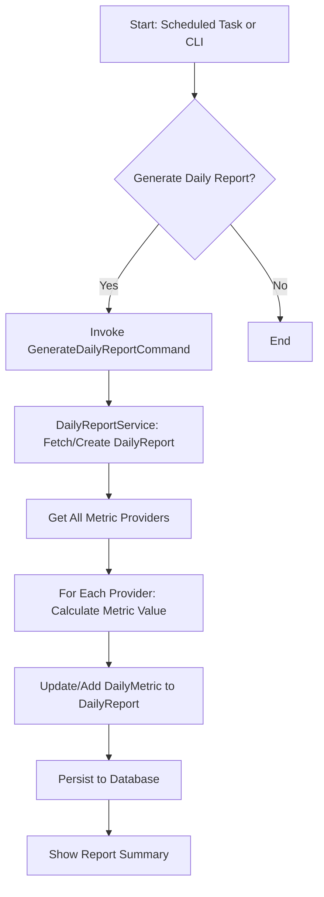

# Workflow (Statistics Bundle)

- Daily statistics can be generated automatically via scheduled tasks or manually via CLI.
- The service fetches all registered metric providers, calculates each metric, and persists the results.
- New metrics can be added by implementing MetricProviderInterface.
