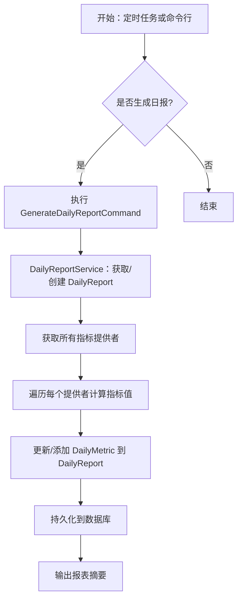

# 工作流程（统计模块）

```mermaid
flowchart TD
    A[开始：定时任务或命令行] --> B{是否生成日报?}
    B -- 是 --> C[执行 GenerateDailyReportCommand]
    C --> D[DailyReportService：获取/创建 DailyReport]
    D --> E[获取所有指标提供者]
    E --> F[遍历每个提供者计算指标值]
    F --> G[更新/添加 DailyMetric 到 DailyReport]
    G --> H[持久化到数据库]
    H --> I[输出报表摘要]
    B -- 否 --> Z[结束]
```

- 每日统计可通过定时任务自动生成，也可手动通过命令行生成。
- 服务会收集所有已注册的指标提供者，计算各项指标并保存。
- 新增指标只需实现 MetricProviderInterface 接口即可。
